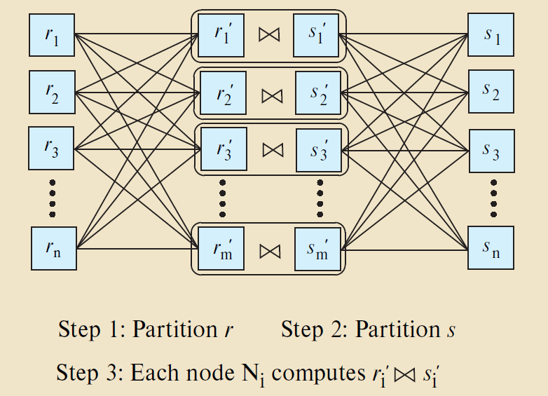

# BOOK 22

### pre-talk

主要是一些名词, 并行可以从不同层次去讨论:

1. **transactions**/**queries**的并行;
2. **Individual relational operations**的并行, 一个*queries*由很多关系运算(正如LEC12中见到的)组成, 我们可以并行运行这些操作;
3. **parallelize the execution of single relational operations**, 一个操作, 可能会读/写很多个文件, 对一个操作我们也可以进一步细分然后并行;

上面展示的, 从最高层的事务/查询抽象, 一步一步最后落到文件, 或者说blocks/pages上, 我们将事务/查询的并行叫做 ***Interquery Parallelism查询间并行***, 而将第二第三称为 ***Intraquery Parallelism查询内并行***, 查询内并行又可以再分为*Intraoperation Parallelism*和*Interoperation Parallelism*.

在不同层进行并行的效果肯定是不一样的, 按自然的想法, *Interquery Parallelism*和*Interoperation Parallelism*的并行程度肯定是比*Intraoperation Parallelism*高的, 因为同一个查询的不同关系运算可能存在依赖性, 或者叫存在阻塞型的关系运算.

这一章的假设是:

1. read-only queries;
2. shared-nothing architecture, 主要和shared-memory and shared-disk systems做区分, 
3. n nodes, $N_1$, ..., $N_n$
4. Initial focus on parallelization to a shared-nothing node
5. Shared-nothing architectures can be efficiently simulated on shared-memory and shared-disk systems.   

需要补一下**shared-nothing**的知识: 

- [数据库架构设计的三种模式：share nothing , share everythong , share disk](https://www.cnblogs.com/kzwrcom/p/6397709.html)
- [一篇85年的关于Shared Nothing架构的文章](https://zhuanlan.zhihu.com/p/386257529)

## 并行排序

1. [Range-partitioning sort](https://www.exploredatabase.com/2014/03/range-partitioning-sort.html) 浅显易懂, 非常好用
2. [Parallel External Sort-Merge](https://www.exploredatabase.com/2014/03/parallel-database-parallel-external-sort-merge-technique.html)

## 并行Join

>> Parallel join algorithms attempt to divide the tuples of the input relations over several
nodes. Each node then computes part of the join locally. Then, the system collects the
results from each node to produce the final result. How exactly to divide the tuples
depends on the join algorithm, as we see next.

并行Join算法试图将输入*relations*的*tuples*分布在多个节点上. 然后, 每个节点在本地计算Join的一部分. 接着, 系统从每个节点收集结果以产生最终结果.

Partitioned join的两个方式:

- Range partitioning on the join attributes
- Hash partitioning on the join attributes

# LEC 13

## 如果有多余的时间, 可以补充学习

课上PPT涉及到书上的内容, 不过大多没有细讲, 只是提及或者展示了一下, 更详细的在书上(但书讲的感觉很差)

- 并发哈希 (并发排序)
- exchange算子
- pipelined parallelism, 流水线并行, 对于阻塞性的操作符就不可以, 所以更多出现在**流处理系统中**

## Process Model

这个主题更多的像一个历史回顾, 现在可能大多数都使用的是线程模型, 由DBMS自己来控制调度策略: 每个查询拆成多少个任务, 使用多少个CPU cores, 任务分配到哪个core, 任务的输入和输出, 等等, 让DBMS自己做肯定是更好的.

## Execution Parallelism

这里的并行化都是比较符合常规的, 很容易想到也, 和书上一致

1. Inter-query Parallelism
2. Intra-query Parallelism
   - Intra-operator Parallelism (Horizontal)
   - Inter-operator Parallelism (Vertical)

***一些数据*** [Latency Numbers You should know](https://samwho.dev/numbers/)

1. `L1 cache`: 1ns
2. `branch mispredict`: 3ns
3. `L2 cache`: 4ns
4. `Send 1K bytes over 1 Gbps network`: 11ns
5. `Mutex lock/unlock`: 17ns
6. `Main memory reference`: 100ns (x100)
7. `Read 1 MB sequentially from memory`: 1000ns ($1*10^3$)
8. `Compress 1K bytes with Zippy`: 2000ns ($2*10^3$)
9. `Read 4K randomly from SSD`: 16000ns (16us) ($2*10^4$)
10. `Read 1 MB sequentially from SSD`: 19,000ns (19us) ($2*10^4$)
11. `Read 1 MB sequentially from disk`: 474,000 (474us) ($4*10^5$)
12. `Round trip within same datacenter`: 500,000 (500us) ($5*10^5$)
13. `Disk seek`: 2,000,000ns (2ms, 2000us) ($2*10^6$)
14. `Send packet CA->Netherlands->CA`: 150,000,000ns (150ms 150,000us) ($1.5*10^8$)

# 一些值得讨论, 后续高级课程也会涉及的内容

## I/O层的并行

如果磁盘始终是主要瓶颈, 使用额外的进程或线程来并行执行查询也无济于事, 我们深入到存储层之后, 就多了一些trade-off的选择, PPT上列举了一些:

1. Multiple Disks per Database
2. One Database per Disk
3. One Relation per Disk
4. Split Relation across Multiple Disks(更自由地的存储方式)

这里提前讲一下I/O的并行, 因为PPT上是放在了下一个主题, 完成了P1的优化后, 应该对此有更深的理解, 一个关系的表, 我们可能存放在不同磁盘 中, 在读取的时候, 同时让多个线程或者进程从不同磁盘中读取不同的page.

## Multiple Disks Parallelism(谈论可用性与容量的trade-off现象)

然后这里讨论了容错的问题, (这里展示了一张集合图, 虽然名称不一样, 不过和CAP理论表达的意思是一样的), 对于**Durability可用性**, 无非就是数据拷贝多份来解决, 这里提到在哪一层解决该问题, **Hardware-based**或**Software-based**, 在过去往往是基于硬件, 比如RAID技术, 更现代一点的做法是把这个任务完全交给软件了, 即将这一个任务接手过来, 让软件和硬件之间有更清晰的职责分工.

**可用性**和**Capacity容量**现在仍还是互斥的, 要么浪费空间去拷贝数据提供高可用性, 要么减少拷贝或者不拷贝提高容量.

提到了一个开放性的问题, 即存储架构通常对数据库系统是透明的, 但是这种透明性应该达到何种程度还可以继续考虑, 因为数据库系统对存储了解的越多, 就能在一些方面做的更好.

## Database Partition

该主体针对的我觉得应该是分布式数据系统, 我们可以指定数据存到哪一个数据中心(单个数据库)之类的;

## Partition

这里再一次细化了分区的粒度, 不过这里对用户透明, 单个表的数据同样也可以分裂成多份存储到不同位置, 单机上来说, 可以存到不同的磁盘,  分布式来说, 可以存到不同的主机上.