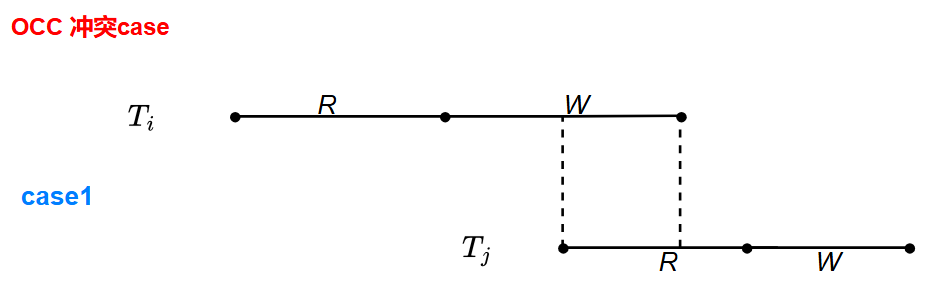
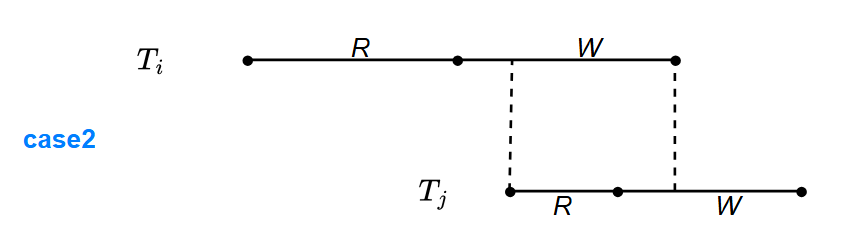
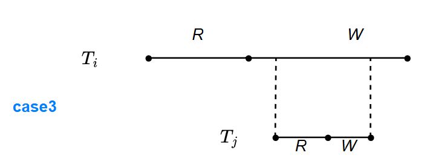
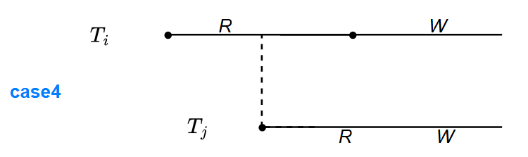
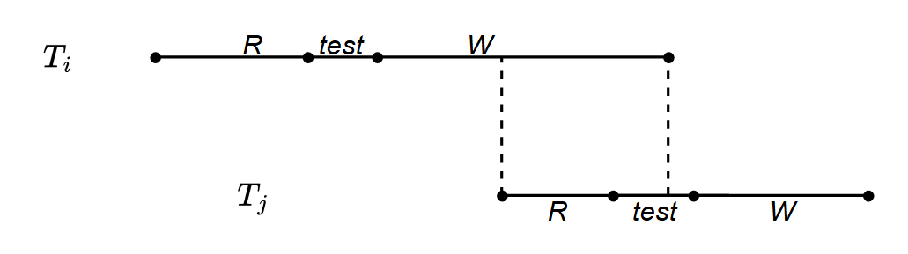

## Timestamp-Based Protocols

另一种**Pessimistic**的并发控制策略.

DBMS为每个事务赋予一个唯一的时间戳, 这个时间戳的形式通常是:

1. **system clock**(`spanner`中谷歌在各个数据中心都配有原子钟)
2. **logical counter**

然后存储的每份数据(data item) `Q` 持久化地记录额外两个时间戳:

1. **W-timestamp**: 写时间戳
2. **R-timestamp**: 读时间戳 (maybe 不需要? )

准备了这些数据结构后, 就可以用 ***timestamp-ordering protocol*** 来进行并发控制.

- 对于事务中的读数据Q
  1. 如果TS(T) < W-time(Q): 视为要读值被覆盖, 拒绝读取并回滚事务
  2. 如果TS(T) >= W-time(Q): 读到最新的值, 接受读取并更新R-time(Q);
- 对于事务中的写数据Q
  1. 如果TS(T) < R-time(Q): 写入旧值的case1, 其他事务已读取过数据Q, 假设其不会被修改, DBMS拒绝该次写入, 并回滚事务
  2. 如果TS(T) < W-time(Q): 写入旧值的case2, 拒绝落后的写操作, 并回滚事务
  3. 其余情况均成功写入并更新W-time(Q);

对于写数据的规则中, 两条**写入旧值**的case, 我感觉是可以根据场景放宽条件做优化的, 不过这个想法部分已经体现在接下来的 ***Thomas' Write Rule*** 中了, 先来看看吧.

Thomas的写规则, 基于一个发现: 

```
  T_27     |    T_28
  Read(Q)  |
           |  Write(Q)
  Write(Q) |
```

- 对于事务中的写数据Q
  1. 如果TS(T) < R-time(Q): 写入旧值的case1, 其他事务已读取过数据Q, 假设其不会被修改, DBMS拒绝该次写入, 并回滚事务
  2. 如果TS(T) < W-time(Q): 写入旧值的case2, 落后的写操作, DBMS选择忽略该条写操作, 不会回滚整个事务
  3. 其余情况均成功写入并更新W-time(Q);

道理很浅显, $T_{27}$中的写操作是没有意义的, 因为更大时间戳的*Write(Q)*已经被执行, 不会有其他人需要读取$T_{27}$的修改数据, 因此可以忽略其, 而不必整个事务回滚

## Validation-Based Protocols

2PC和T-O并发控制都是悲观的并发控制, 而**Validation-Based Protocols**则是一种*Optimistic Concurrency Control Technique*.

> In cases where amajority of transactions are read-only transactions, the rate of conflicts among transactions may be low.

对读多的场景用乐观策略, 现在看来应该是一种常识了,我觉得只要对**稀少的冲突现象提供检测机制**, 在这种场景下并发的程度都挺高.

在该策略下的事务执行生命周期分为**读取**, **验证**, **写入**: 

1. **Read Phase**: 读取数据, 并将写操作记录在本地内存;
2. **Validation Phase**: 对该事务运行*validation test*, 如果不通过系统将丢弃此次事务;
3. **Write Phase**: 如果是写事务且通过了*validation test*, 则将本地的写操作*apply*到数据库

那么重点便是*validation test*, 为此系统为每个事务维护三个时间戳:

1. **StartTS(T)**: 事务T开始执行的时间
2. **ValidationTS(T)**: 事务T开始进行*Validation Phase*的时间
3. **FinishTS(T)**: 事务T结束*Write Phase*的时间

其中, 事务开始验证测试的时间用于决定串行化的顺序(就是说, 如果在一条时间线上, 把事务抽象出来绘制的时候, 起点的时间应该是*ValidationTS(T)*).

---

***occ冲突***

如果觉得书上的分析比较抽象, 那么可以从*Event-Driven*的角度去考虑: 



$T_i$的写阶段持续到$T_j$的读阶段, 那么此时我们要验证的就是$T_j$的读集合与$T_i$的写集合



$T_i$的写阶段覆盖了$T_j$的读阶段, 持续到了$T_j$的写阶段, 除了*case1*的读写集合验证以外, 还要检查写写冲突, 即$T_j$的写集合也需要跟$T_i$的写集合验证



*case3*仅为了讨论*case*的完整性, 和*case2*同理.



当$T_i$的读阶段结束时刻"跨入"$T_j$的读阶段时, 我们不为读读冲突进行集合验证, 但是我们需要考虑此时谁的读阶段先结束:

1. 如果是$T_i$的读阶段先结束, 那么*case4*等价于*case1+2+3*;
2. 如果是$T_j$的读阶段先结束, 那么就需要更深入地思考一下了, 在系统的视角下, $T_i$确实是比$T_j$先开启的, 但由于OCC的读阶段没有对数据造成修改, 我们在读阶段做这么仔细的先后定义是没有必要的, 此时我们等价于交换下标$i$, $j$的*case1+2+3*;

可以看出, *case4*等价于*case1+2+3*, *case3*等价于*case2*, 我们仅需要分析*case1+2*即可, 而我们知道, *validation test*在读阶段结束后进行, *case1*和*case2*在写阶段才进行区分, 那么$T_j$事务需要提前做集合验证, 依据$T_j$在验证阶段开始的时候$T_i$的写阶段是否结束 (该消息系统应该对$T_i$以外的事务可见才行)



那么对写写冲突做的集合验证, 可能存在的浪费情形如上图, 不过我们可以尽量把"询问是否存在写写冲突"这种逻辑在*validation test*的代码里靠后执行, 尽可能来减少上图这种情况发生的频率.

***总结OCC***

当大多数事务都是*read-only*时, 少部分*write*事务的数据集又不相交, *OCC*的策略效果就非常显著. 不过也有一部分缺陷:

1. 在*Read phase*我们将数据*copy*到了本地这是一个开销;
2. *Validation/Write phase*是潜在的瓶颈, 如果这里的并行做的不好, 可能导致大多数事务都阻塞在这两个阶段;
3. 验证不通过, 终止事务的开销比较大

相关文献, 按时间线(TODO : READ)

1. 理论研究: *On Optimistic Methods for Concurrency Control 1981*
2. 理论研究: *Optimistic Methods for Concurrency Control in Distributed Database Systems 1981*
3. 理论研究: *Problems of Optimistic Concurrency Control in Distributed Database Systems 1982*
4. 理论研究: *Observations on optimistic concurrency control schemes 1984*
5. 原型系统: *Distributed transaction management in jasmin VLDB 1984* 
6. 理论研究: *Certification by intervals of timestamps in distributeddatabase systems 1984* 
7. 生产系统: *Megastore: Providing Scalable, Highly Available Storage for Interactive Services CIDR 2011*
8. 生产系统: *High-Performance Concurrency Control Mechanisms for Main-Memory Databases VLDB 2012*
9. 生产系统: *F1: A Distributed SQL Database That Scales VLDB 2013*
10. 原型系统: *MaaT: Effective and scalable coordination of distributedtransactions in the cloud VLDB 2014*
11. 原型系统: *Centiman: Elastic, High Performance Optimistic Concurrency Control by Watermarking 2015*
12. ? : *Opportunities for Optimism in Contended MainMemory Multicore Transactions VLDB 2020*


## The Phantom Problem

产生的源头应该可以认为是为了更大的并行程度从而把锁粒度调整到*record*, 而对

