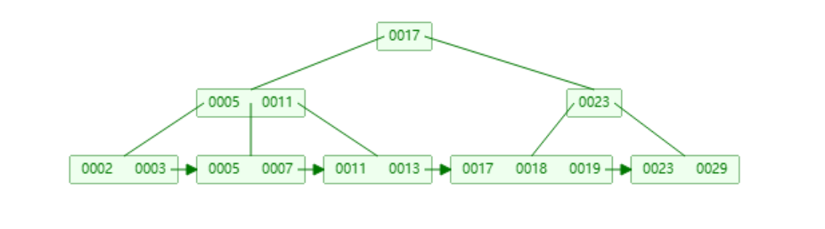

# p2

## 涉及文件

## 接口

感觉不懂的很多, 各种类型的参数, 先从建树需要的参数入手吧.

#### 建树

模板的参数, `<typename KeyType, typename ValueType, typename KeyComparator>`

- `KeyType` --- `GenericKey<8>`;
- `ValueType` --- `RID`;
- `KeyComparator` --- `GenericComparator<8>`

我们实现的B+索引只支持唯一键, 所以我猜测`GenericKey<N>`是用来生成独一无二的key值; `KeyComparator`是一个封装好的手动比大小的东西, 用于比较两个`KeyType`实例的大小.

---

查看`b_plus_tree_insert_test.cpp`文件第一个测试`InsertTest1`, 对照着`BPlusTree(...)`查看这些参数的含义:

1. `foo_pk`, e... std::string类型的, 树名, 同一份关系我们可能建多个索引吧.
2. `page_id`, 调用`bpm->NewPage()`接口分配的page资源句柄, 检查`bpm_bench.cpp`以及`NewPage()`实现, 这里并未实际为该`page_id`分配*frame*, 需要后续读写的时候再调用`WritePage(page_id)/ReadPage(page_id)`, 因为创建索引本身要占用一些空间存储metadata, 所以分配一页的内存没有什么特别的.
3. `bpm`, 缓冲池管理器, 正常的参数, 需要使用内存应该都走bpm.
4. `comparator`, KeyComparator比较两个键的大小, 使用方法`comparator(lhs, rhs)`, 返回: 
    - -1 -- lhs < rhs;
    - 1 -- lhs > rhs;
    - 0 -- lhs = rhs
5. `leaf_max_size`, 常规参数
6. `internal_max_size`, 常规参数


####  Node

可以看到, 在`b_plus_tree.h`文件里面:

```cpp
using InternalPage = BPlusTreeInternalPage<KeyType, page_id_t, KeyComparator>;
using LeafPage = BPlusTreeLeafPage<KeyType, ValueType, KeyComparator>;
```

同时看叶子节点(LeafPage)的头文件, `next_page_id_`的参数类型是`page_id_t`, 这说明了什么?  因为我没有发现每个节点没有记录类似偏移量之类的东西, 所以我猜测这里的B+树索引每一个节点单独占据了一个page;

1. 对于叶子节点来说, 这表明我们使用的应该是**聚簇索引**或者**值索引**:
    - 数据访问更快, 避免了二次索引;
    - 数据存储紧凑, 同时因为放在了叶子节点里, 我们可以组织成连续的物理地址;
    - 对节点的操作成本更大了, 做分裂合并之类的操作时, 同时又想保证物理地址连续就需要做拷贝之类的比较大的开销;
2. 对于内部节点来说, 我觉得可能需要自己添加偏移量之类的, 一个page一个节点的内存浪费或许太高了, 当然也有可能这里就是后续优化内存利用率的地方.

将`InternalPage`和`LeafPage`的模板参数实际翻译一下可以发现, 内部节点一个k/v占了8+4(`GenericKey<8>` + `int32_t(page_id_t)`)=12字节, 叶子节点一个k/v占了8+8(`GenericKey<8>`+`RID`)=16字节

在头文件中定义的宏常量:

1. `INTERNAL_PAGE_HEADER_SIZE`=12 和`LEAF_PAGE_HEADER_SIZE`=16
2. `INTERNAL_PAGE_SIZE`=(4096-12)/12=340(取整), `LEAF_PAGE_SIZE`=(4096-16)/16=255

不难发现, 叶子节点的头部字节多了4, 是因为类成员多了一个`next_page_id_`

每个节点创建的时候我们就需要使用`bpm`去分配实际的内存, 这一点, 在`BPlusTree`的构造函数里面, Andy和TAs很贴心给了示范(P1的测试代码中也有):

```cpp
INDEX_TEMPLATE_ARGUMENTS
BPLUSTREE_TYPE::BPlusTree(...): ... {
	WritePageGuard guard = bpm_->WritePage(header_page_id_);
  auto root_page = guard.AsMut<BPlusTreeHeaderPage>();
  root_page->root_page_id_ = -1;
}
```

不过先来看看之前没有注意过的PageGuard里的接口`As()/AsMut()`

```cpp
// GetData()和GetDataMut()都是返回FrameHeader中的`data_.data()`
template <class T>
auto As() const -> const T * {
	return reinterpret_cast<const T *>(GetData());
}

template <class T>
auto AsMut() -> T * {
	return reinterpret_cast<T *>(GetDataMut());
}
```

结合`std::vector::data`总的来说就是获取了一个page的内存, 然后转成了`BPlusTreeHeaderPage`类型的指针.

能够看到, 建好树后, 我们拥有一个frame(page), 存储的类`BPlusTreeHeaderPage`, 其只有一个内容: `root_page_id_` = INVALID_PAGE_ID, 然后内存中还有一个数据`header_page_id_`, 是该frame(page)的page_id;

#### BPLUSTREE_TYPE::GetRootPageId()

在测试中, 这里往树插入一个键后再调用的该接口, 返回的是一个page_id, 然后转成了BPlusTreePage类型指针, 这显然和建树时不一样了, 当时的`header_page_id_`指向一块page应该是转成BPlusTreeHeaderPage类型, 所以这里要返回的, 我想应该是插入键后, 创建了一个节点, 分配了page, 作为根节点, 然后header_page_id_指向page里面存的root_page_id_就应该指向根节点使用的page;

至此我大概理清楚了从建树开始到插入第一个键值中间的这些page_id分别是指向什么:

1. `header_page_id`, 整个树的类成员, 指向page只存储了一个`root_page_id_`, 实际上现在树中还没有任何节点(我也不知道一开始的代码为什么要用`auto root_page=...`, 误导了一下我)
2. `root_page_id_`, 根节点, 也是树的第一个实际节点, 要么是一个叶子节点(当前树仅它一个节点时), 要么是一个内部节点.

---

然后再回过头写叶子节点和内部节点类的一些函数就要舒服点了.


#### 搜索


#### 插入

`tree.Insert(index_key, rid, transaction);`, 查看函数的定义: 

1. `index_key`, `rid`, k/v对
2. `transaction` 事务号, 暂时不用;

因为之前自己写过B+树的插入, 所以这里捋的比较清楚, 按不同case来写逻辑比较清楚:

1. *case1* : **树为空**, 说明我们还没有建立根节点, 新建一个LeafPage类型的节点作为根节点插入即可.

2. *case2* : **待插入节点不满**, 在这之前肯定是有*search*的逻辑的, 那我们在之前已经实现了, 直接插入该叶子节点即可

3. *case3* : **待插入节点已满**, 这是插入逻辑最麻烦的一个, 主要是因为需要修改父节点的指针, 同时还需要向父节点插入键值, 使得整个插入逻辑需要对父节点递归地做一遍, 和自己实现不同, 实验中需要讨论的难点在于如何访问从根节点到待插入节点路径上的任一节点

**维护从根节点到叶子节点的路径** 在我自己实现B+的时候, 我允许每个节点维护一个指向父节点的指针, 在每次搜索的时候进行更新, 即*down*的过程维护出一条逻辑队列, *up*溯源的时候通过递归即可, 实验中, 为我们提供了`Context`类, 做的事情是类似的; *down*的过程将路径节点加入队列, *up*的时候每次递归从队列中弹出一个即可.

解决了父节点的问题, 那么剩下就是递归往上检查分裂条件了, 大体逻辑是类似的, 需要注意的是
 
1. **移动语义下PageGuard的资源句柄在哪儿, 如何检查ctx**
2. **分裂时叶子节点和内部节点的差异, 特别关注内部节点的Size**
3. **header_page_id和root_page_id_不一样, 新建根节点后要记得更新tree_page里的记录**

---

码力比较差, 即使写过简单的demo再来完成实验的插入也花费了很多时间, 更主要的原因在于精神不集中吧/笑.

#### 删除

B+的删除是一个看起比较困难, 实际写起来也很繁琐的操作, 在我自己的demo里也没有耐心去实现, 所以这里算是第一次实现, 记录的会详细一些, 逻辑可能也不会那么清晰;

***Fix underflow condition***

大概删除操作的难点在维护B+节点半满的不变性, 从节点中删除一个键后可能会使该节点违反B+的不变性, 这种状态称为**underflow condition**, 我们要做的就是修复这个状态, 说了这么多就是维持节点半满.

我后来想了一下, 不一定非得半满, 这个阈值完全由我们决定, 比如说, **如果阈值设置的太低**, 删除就很容易导致节点*merge*, 整体上*merge*的频率会变得很高, 但单次*merge*的代价不会那么高; **而阈值设置的太高**, 虽然减少了*merge*的频率, 节点的平均容量变大了, 但是单次*merge*的代价会更高, 同时树也更加扁平, 纵向的搜索深度会小于横向的搜索宽度. 

不过这些都是在*in-memory*层次考虑的, 回顾LEC8里谈到的`B+tree's build advice`, 站在磁盘I/O的角度上去思考的话, 和考虑**叶子节点的大小**是类似的.

所以为了把这个不变性质抽象出来, 单独列一个判断的谓词**SizeInvariantCheck()**, **除此之外**, 还涉及的一个性质是内部节点的键值等于其指针指向的节点存储的第一个键值, 这也需要我们维护;

---

我们用`Context`类维护了根到叶子的路径, 但是过程在写的过程发现还可以维护更多的信息, 或者说牺牲空间来支持快速的一些查询: 当我尝试获取`leaf_page`的左兄弟的时候, 我不得不在其父节点的`array_[]`字段中二分查询, 如果能同时记录下`leaf_page`在父节点中存储的位置就可以避免查询了.

不过看了一下数据, 保守的计算一下平均每次查找也就$log_2{400}$, 8~9的样子, 而且如果多消耗内存说不定会引起更多的磁盘I/O就得不偿失了, 所以这里就二分查询就好了.

叶子节点和内部节点的fix操作不相同, 所以分开来.


虽然只说了节点处于*underflow condition*, 不过也有两类情况, 以及其对应的解决方案;

1. 叶子节点键值数过少, 但不为0
    - 尝试`pop_back`左兄弟的kv并`push_front`到自己;
    - 尝试`pop_front`右兄弟的kv并`push_back`到自己;
2. 叶子节点键值数为0
    - 与左兄弟合并
    - 与右兄弟合并

***merge要做的事***

回想一下之前, 我们删除了kv, 但是却不更新内部节点, 正是因为没有同步更新 内部节点, 所以我们并没有维护严格的一个"指示", 也就是内部节点$P_i$指向叶子节点$Leaf_i$的第一个键$K_{leaf}$, 并不等于内部节点中的$K_i$:

```
K1              K2           K3
|               |            |
+-⚪---⚪------+-⚪---------+
   a    b          c     
[K1, K2)        [K2, K3)
```

像上图那样, 内部节点存储的$K_1, K_2, K_3$只是充当一个指向标, 更细的划分了值域, a, c不会严格等于$K_1$和$K_2$了, 那么当我们把被合并节点的键值c移到a,b后面, 我们要同步删掉内部节点的$K_2$, 就需要在内部节点中利用b,c的值二分查找 $b < K_i <= c$

#### 删除补充case讨论

有一些例子, 我自己尝试写B+的时候遇到了没有解决, 现在开始写实验了也没有发现一个妥善的解决方案: 



这个状态的B+首先是可以被构造出来的, 这是我一个一个*Insert*创建出来的, 对于删除17之后的修改, 

# Cpp

`std::vector<T,Allocator>::data()`和`reinterpret_cast<T>(exp)`搭配使用, 简单来说就是获取一个指向[`data()`, `data()+size()`]的指针, 并转成类型`T`.

编写`GetLeafPage()`时, 我一开始返回的是`page_id_t`变量, 当我在`Insert()`中使用它的时候, 我发现我的使用场景是**获取page_id, 立刻获取WritePageGuard**, 这里就有两种设计方案, 其中分析过后是有问题的:

1. `GetLeafPage()`中全局持读锁, 以`ReadPageGuard`的形式寻找*leaf page*, 然后返回其对应page的page_id
2. `GetLeafPage()`中全局持写锁, 以`WritePageGuard`的形式寻找*leaf page*, 然后显式地用`std::move()`返回其右值给调用者

第一种方式需要调用者通过`page_id_t`再次获得写锁构造`WritePageGuard`, 这中间会出现空档期, 导致该*leaf page*有被修改的可能, 所以我们不得不采用第二种;


#### BUGs

花费了很久的时间, 定位到了错误 ( 祝我的好友kumiko生日喵! )

```sh
08.663 [b_plus_tree_leaf_page.cpp:295:RemoveKey] INFO  - 已删除 47873
08.663 [b_plus_tree.cpp:390:FixUnderflowLeaf] INFO  - 父节点page518, idx2update=24
08.663 [b_plus_tree.cpp:392:FixUnderflowLeaf] INFO  - 在父节点中记录: left:379, self:379, right:381
08.663 [b_plus_tree.cpp:397:FixUnderflowLeaf] INFO  - left:379, self:379, right:380
```

父节点: page_id = 518 中的array_错乱了, 就这里而言是

- array_[24-1] = 379 left
- array_[24]   = 379 now
- array_[24+1] = 381 right

而实际是now->nextpage_id应该是380, left也不对

我定位错误的策略大致是: 

1. 先判断并发有无问题, 在`bree-bench`中分别测试几种并发情况, 读并发, 写并发, 读写并发.

**第一个BUGs, 由于pop/push函数写错了, 对内部节点的下标多加了1**

在找第一个BUG的过程中我发现, 提示报DeadLock, 一般指的是在同一个进程中连续请求一把锁.

现在改完后我开了写并发, 也就是仅把读注释掉, 大概测10次能发现3次同样的死锁报错: 

```sh
terminate called after throwing an instance of 'std::system_error'
  what():  Resource deadlock avoided
```

因为我不是很乐意相信这是并发导致的死锁, 因为我没有并没有开Latch crabbing, 下降的时候, 路径上的pageguard应该都是拿着锁的.

```sh
terminate called after throwing an instance of 'std::system_error'
  what():  Resource deadlock avoided

Thread 794 "bustub-btree-be" received signal SIGABRT, Aborted.
[Switching to Thread 0x7ffe4c780640 (LWP 26846)]
__pthread_kill_implementation (no_tid=0, signo=6, threadid=140730181355072) at ./nptl/pthread_kill.c:44
44      ./nptl/pthread_kill.c: No such file or directory.
(gdb) bt
#0  __pthread_kill_implementation (no_tid=0, signo=6, threadid=140730181355072) at ./nptl/pthread_kill.c:44
#1  __pthread_kill_internal (signo=6, threadid=140730181355072) at ./nptl/pthread_kill.c:78
#2  __GI___pthread_kill (threadid=140730181355072, signo=signo@entry=6) at ./nptl/pthread_kill.c:89
#3  0x00007ffff7a93476 in __GI_raise (sig=sig@entry=6) at ../sysdeps/posix/raise.c:26
#4  0x00007ffff7a797f3 in __GI_abort () at ./stdlib/abort.c:79
#5  0x00007ffff7e23b9e in ?? () from /lib/x86_64-linux-gnu/libstdc++.so.6
#6  0x00007ffff7e2f20c in ?? () from /lib/x86_64-linux-gnu/libstdc++.so.6
#7  0x00007ffff7e2f277 in std::terminate() () from /lib/x86_64-linux-gnu/libstdc++.so.6
#8  0x00007ffff7e2f4d8 in __cxa_throw () from /lib/x86_64-linux-gnu/libstdc++.so.6
#9  0x00007ffff7e2683c in std::__throw_system_error(int) () from /lib/x86_64-linux-gnu/libstdc++.so.6
#10 0x000055555556de4f in std::__shared_mutex_pthread::lock (this=<optimized out>)
    at /usr/bin/../lib/gcc/x86_64-linux-gnu/11/../../../../include/c++/11/shared_mutex:195
--Type <RET> for more, q to quit, c to continue without paging--
#11 std::shared_mutex::lock (this=<optimized out>) at /usr/bin/../lib/gcc/x86_64-linux-gnu/11/../../../../include/c++/11/shared_mutex:420
#12 bustub::FrameHeader::WLatch (this=<optimized out>) at /home/refrain/bustub_dbms/src/include/buffer/buffer_pool_manager.h:87
#13 bustub::BufferPoolManager::CheckedWritePage (this=0x555555602a80, page_id=81, access_type=<optimized out>)
    at /home/refrain/bustub_dbms/src/buffer/buffer_pool_manager.cpp:166
#14 0x000055555556f505 in bustub::BufferPoolManager::WritePage (this=0x68de, page_id=81, access_type=4155406844)
    at /home/refrain/bustub_dbms/src/buffer/buffer_pool_manager.cpp:316
#15 0x000055555557de5c in bustub::BPlusTree<bustub::GenericKey<8ul>, bustub::RID, bustub::GenericComparator<8ul> >::FixUnderflowLeaf (this=0x0, 
    this@entry=0x7fffffffcb00, ctx=..., leaf_page=leaf_page@entry=0x555555741f60, leafpage_guard=..., key=...)
    at /home/refrain/bustub_dbms/src/storage/index/b_plus_tree.cpp:396
#16 0x000055555557dc1c in bustub::BPlusTree<bustub::GenericKey<8ul>, bustub::RID, bustub::GenericComparator<8ul> >::Remove (this=0x7fffffffcb00, 
    key=..., txn=<optimized out>) at /home/refrain/bustub_dbms/src/storage/index/b_plus_tree.cpp:149
#17 0x000055555555ff21 in main::$_0::operator() (this=0x8) at /home/refrain/bustub_dbms/tools/btree_bench/btree_bench.cpp:248
--Type <RET> for more, q to quit, c to continue without paging--
#18 std::__invoke_impl<void, main::$_0> (__f=...) at /usr/bin/../lib/gcc/x86_64-linux-gnu/11/../../../../include/c++/11/bits/invoke.h:61
#19 std::__invoke<main::$_0> (__fn=...) at /usr/bin/../lib/gcc/x86_64-linux-gnu/11/../../../../include/c++/11/bits/invoke.h:96
#20 std::thread::_Invoker<std::tuple<main::$_0> >::_M_invoke<0ul> (this=0x8)
    at /usr/bin/../lib/gcc/x86_64-linux-gnu/11/../../../../include/c++/11/bits/std_thread.h:259
#21 std::thread::_Invoker<std::tuple<main::$_0> >::operator() (this=0x8)
    at /usr/bin/../lib/gcc/x86_64-linux-gnu/11/../../../../include/c++/11/bits/std_thread.h:266
#22 std::thread::_State_impl<std::thread::_Invoker<std::tuple<main::$_0> > >::_M_run (this=0x0)
    at /usr/bin/../lib/gcc/x86_64-linux-gnu/11/../../../../include/c++/11/bits/std_thread.h:211
#23 0x00007ffff7e5d253 in ?? () from /lib/x86_64-linux-gnu/libstdc++.so.6
#24 0x00007ffff7ae5ac3 in start_thread (arg=<optimized out>) at ./nptl/pthread_create.c:442
#25 0x00007ffff7b77850 in clone3 () at ../sysdeps/unix/sysv/linux/x86_64/clone3.S:81
```

死锁的调用链:

index.Remove(index_key, nullptr)
            ↓
FixUnderflowLeaf()
            ↓
left_guard = bpm_->WritePage(left_page_id);