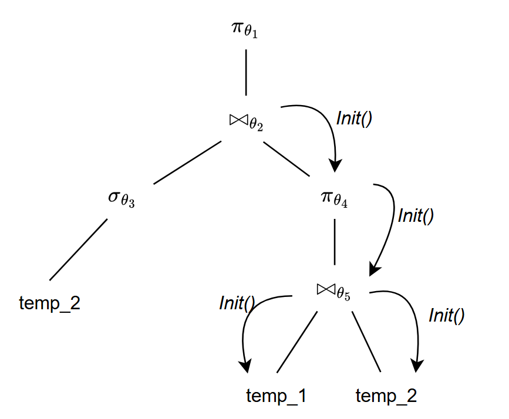

因为后续我想在bustub的基础上做一些自己的改动, 所以从P3开始, 作为dbms的初学者, 我整体阅读一遍bustub的源码.

bustub的开机处在`/tools/shell/shell.cpp`中, 可以在这里查看:

> 创建实例 `auto bustub = std::make_unique<bustub::BusTubInstance>("test.bustub");`

后面可以再回来仔细地看一下**bustub::BusTubInstance**中有哪些成员, 大抵能够代表db有哪些组件(有一部分没有, 因为是学习用项目的原因)

> 生成 *__mock_txx* 表 `bustub->GenerateMockTable();`

> 生成*test_xxx*表 `bustub->GenerateTestTable();`

**注意**: *we don't support create / drop table and insert for now*

主体部分是两个循环: 

```c++
// 持续运行, 直到用户退出
while(true) {
  ...
  // 读取用户输入SQL语句
  while(true) {
    ...
    // linenoise库
    char *query_c_str = linenoise(line_prompt.c_str());
    ...
  }
  ...
  // 执行SQL命令
  bustub->ExecuteSql(query, writer);
  ...
}
```

对于处理用户的输入, 可以使用[linenoise开源库](https://github.com/antirez/linenoise)来读取, 也可以选择开启TTY使用标准输入读取(`std::getline`)

**重点是执行SQL语句**, 以SQL语句`SELECT * FROM __mock_table_1;`为例, 看看如何执行的.

### Binder

虽然感觉没啥作用, 也不需要写什么, 不过就**SELECT**语句而言, 还是看一下是如何在**catalog**中将`*`展开的

```c++
#0 binder.BindStatement(stmt);
 #1 BindStatement(...); // 进一步解包
    #2 BindSelect(...);
      #3 BindFrom(pg_stmt->fromClause); // sql: FROM "relname"
        #4 BindTableRef(node);
          #5 BindRangeVar(...);
            #6 BindBaseTableRef(relname,...);
              #7 catalog_.GetTable(table_name);   // 查表
              #7 table_names_.find(table_name);   // 查表
              #7 tables_.find(table_oid->second); // 查表
          #5 BindJoin(...);
          #5 BindRangeSubselect(...);
      #3 BindSelectList(pg_stmt->targetList); // sql: SELECT n1, n2, ...
         #4 for node in list: 
           #5 BindExpression(node);
             #6 BindStar(node); // SELECT *
         #4 GetAllColumns(*scope_); // SELECT *
      #3 BindWhere(pg_stmt->whereClause); // sql: WHERE...
      #3 BindGroupBy(pg_stmt->groupClause); // sql: GROUP BY...
      ...
```

此外, 要查看`statement`中的内容, 有一个好的方式是检查`HandleExplainStatement()`中, 对每个部分调用的`ToString()`函数

在`BindStatement(stmt)`中还能查看对其他语句的解析.

### Planner

### data struct

P3涉及到的数据结构繁杂而庞大, 一言两语我并不能讲清楚, 更多地需要去阅读源码, 我仅记录下一些花费时间比较久才摸索清楚的数据结构.

一个宏观的视角:

```
Executor
   |
   |--------Context
   |           |
   |           |-------Catalog
   |           |          |
   |           |          |-------TableInfo
   |           |          |          |
   |           |          |          |--------Schema................................+
   |           |          |          |          |                                   |
   |           |          |          |          |-----size                          |
   |           |          |          |          |-----Column1 {name, type, size}    |
   |           |          |          |          |-----Column2 {name, type, size}    |
   |           |          |          |          |-----...                           |
   |           |          |          |                                              |
   |           |          |          |--------TableHeap                             |
   |           |          |          |            |                                 |
   |           |          |          |            |------lock                       |
   |           |          |          |            |------TablePage1                 |
   |           |          |          |            |------TablePage2                 |
   |           |          |          |            |          |                      ↓
   |           |          |          |            |          |-------Tuple1 {RID, data}
   |           |          |          |            |          |-------Tuple2 {RID, data}
   |           |          |          |            |          |-------...            ↑
   |           |          |          |            |------...                        |
   |           |          |          |                                              |
   |           |          |          |--------table_id                              |
   |           |          |          |--------table_name                            |
   |           |          |                                                         |
   |           |          |-------IndexInfo                                         |
   |           |          |          |                                              |
   |           |          |          |-------name                                   |
   |           |          |          |-------type                                   |
   |           |          |          |-------index_oid                              |
   |           |          |          |-------Schema(key_schema).....................+
   |           |          |          |-------Index                                  |
   |           |          |          |         |                                    |
   |           |          |          |         |----KeyComparator                   |
   |           |          |          |         |----BPlusTree(...else)              |
   |           |          |          |         |----IndexMetadata                   |
   |           |          |          |         |         |                          |
   |           |          |          |         |         |---------Schema(key_schema)
   |           |          |          |         |         |---------key_attrs_
   |           |          |          |         |         |---------...
   |           |
   |           |-------BPM
   |           |        |...
   |
   |---------PlanNode
   |            |
   |            |--------Schema(output_schema)
   |            |--------Child_Node
   |            |--------Expression
   |            |             |
   |            |             |------Column(ret_type)
   |            |             |------Child_expr

  


Executor--+--Context--+--Catalog--+--Table
          +           +           +--Index
          +           +--bpm      
          +           +--...
          +
          +--PlanNode-+
```


### Aggregation

草, 怎么突然忘了这些个操作是干啥的.

```sql
create table t1(v1 int, v2 int);
insert into t1 values (1, 10), (2, 10), (3, 20), (5, 10), (7, 20);
select * from t1;
+-------+-------+
| t1.v1 | t1.v2 |
+-------+-------+
| 1     | 10    |
| 2     | 10    |
| 3     | 20    |
| 5     | 10    |
| 7     | 20    |
+-------+-------+
```

***group by, min()***

```sql
select v2, min(v1) as min_v1 from t1 group by v2;
+-------+--------+
| t1.v2 | min_v1 |
+-------+--------+
| 20    | 3      |  # v2 = 20,  min_v1 = min{3, 7}
| 10    | 1      |  # v2 = 10,  min_v1 = min{1, 2, 5}
+-------+--------+
```

***count, min()***

```sql
select v2, count(v1) as cnt_v1, min(v1) as min_v1 from t1 group by v2;
+-------+--------+--------+
| t1.v2 | cnt_v1 | min_v1 |
+-------+--------+--------+
| 20    | 2      | 3      | # v2 = 20, cnt_v1 = count{3,7},  min_v1 = ~
| 10    | 3      | 1      | # v2 = 10, cnt_v1 = count{1,2,5},min_v1 = ~
+-------+--------+--------+
```

### Join

处理一个问题, 现有下面两张表

```sql
+-------+-------+     +-------+-------+
| t1.v1 | t1.v2 |     | t2.v3 | t2.v4 |
+-------+-------+     +-------+-------+
| 1     | 101   |     | 1     | 201   |
| 2     | 102   |     | 1     | 202   |
| 3     | 103   |     | 1     | 203   |
+-------+-------+     +-------+-------+

select * from t1 innner join t2 on v1 = v3;
+-----------+-----------+-------+-------+
| innner.v1 | innner.v2 | t2.v3 | t2.v4 |
+-----------+-----------+-------+-------+
| 1         | 101       | 1     | 201   |
+-----------+-----------+-------+-------+
```

这个问题的原因是由于目前实现的join算子并没有产生临时文件, 每一次都从左表上次执行位置的下一行开始, 从右表中找到一个匹配的就直接吐出一个tuple给父节点, 从而忽略了左表中一行Tuple可以在右表中匹配多行的情况, 暂时想到了以下的方案:

1. 允许`Next()`一次性返回多组tuple, 不过线上测试的实验框架不让改动`bustub_instance.cpp`的代码, 暂时列为(TODO)
2. **NestedIndexJoinPlanNode**记录下上次扫描的位置(左右表都需要)
3. **NestedIndexJoinPlanNode**中存储一次完整的扫描右表结果

第一种方案目前仅in-memory读取数据看起来是很不错的, 第三个方案则视为从第二个方案开始优化, 用一部分临时文件的内存去换取*NestedIndexJoinPlanNode*执行的效率.

```sql
select * from temp_2;
+-------------+-------------+-------------+
| temp_2.cola | temp_2.colb | temp_2.colc |
+-------------+-------------+-------------+

select * from temp_1;
+-------------+-------------+-------------+-------------+
| temp_1.cola | temp_1.colb | temp_1.colc | temp_1.cold |
+-------------+-------------+-------------+-------------+

EXPLAIN (o)
select t2.temp_2.colA from
    (select * from temp_2 where colB < 10) t2 inner join
    (select distinct(temp_2.colA) from temp_1 inner join temp_2 on temp_1.colC = temp_2.colA) t3
     on t2.colB  < t3.colA;
=== OPTIMIZER ===
Projection { exprs=["#0.0"] }
  NestedLoopJoin { type=Inner, predicate=(#0.1<#1.0) }
    SeqScan { table=temp_2, filter=(#0.1<10) }
    Agg { types=[], aggregates=[], group_by=["#0.0"] }
      Projection { exprs=["#0.4"] }
        NestedLoopJoin { type=Inner, predicate=(#0.2=#1.0) }
          SeqScan { table=temp_1 }
          SeqScan { table=temp_2 }
```

<p align="center">
  
</p>

存在的问题就是需要多次扫描右表, 那么会对右子树的算子多次进行初始化